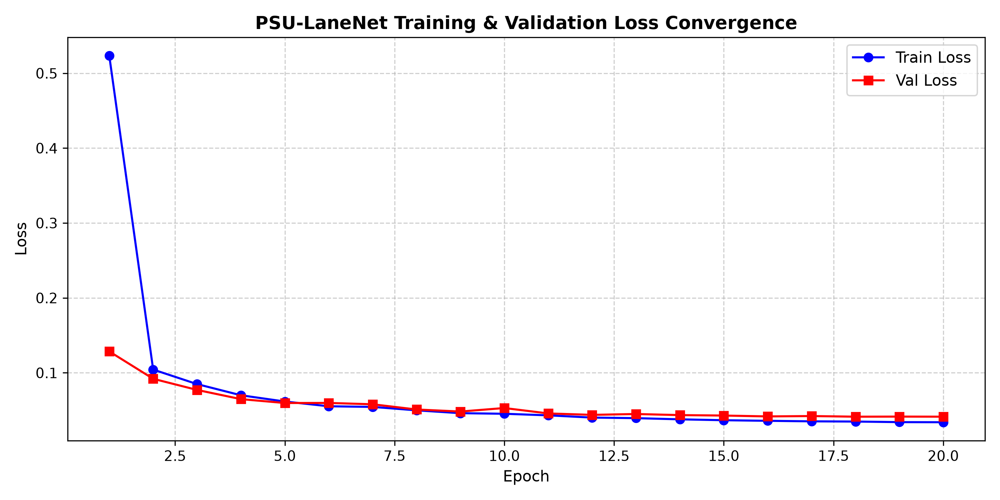
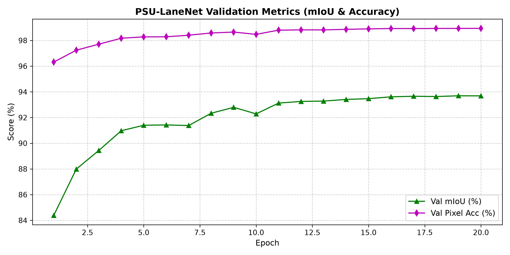
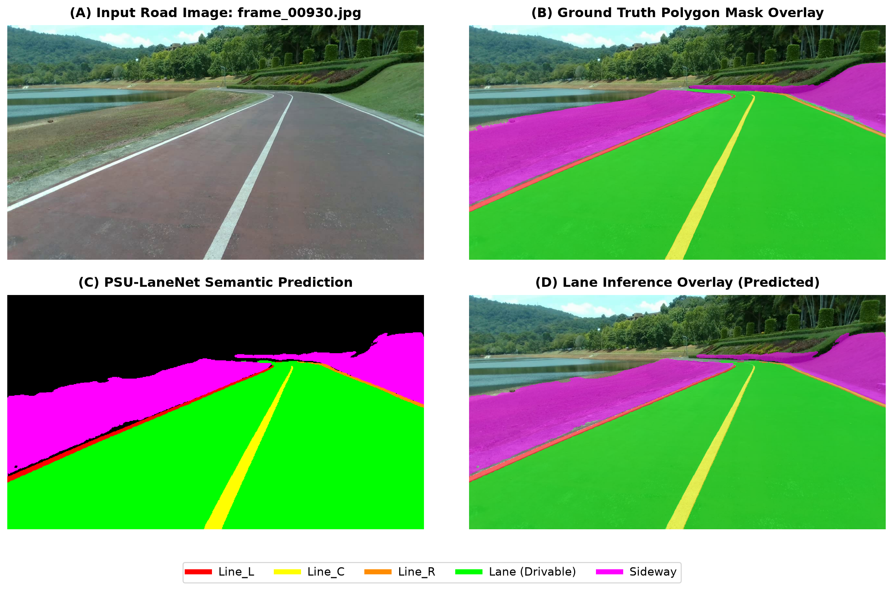
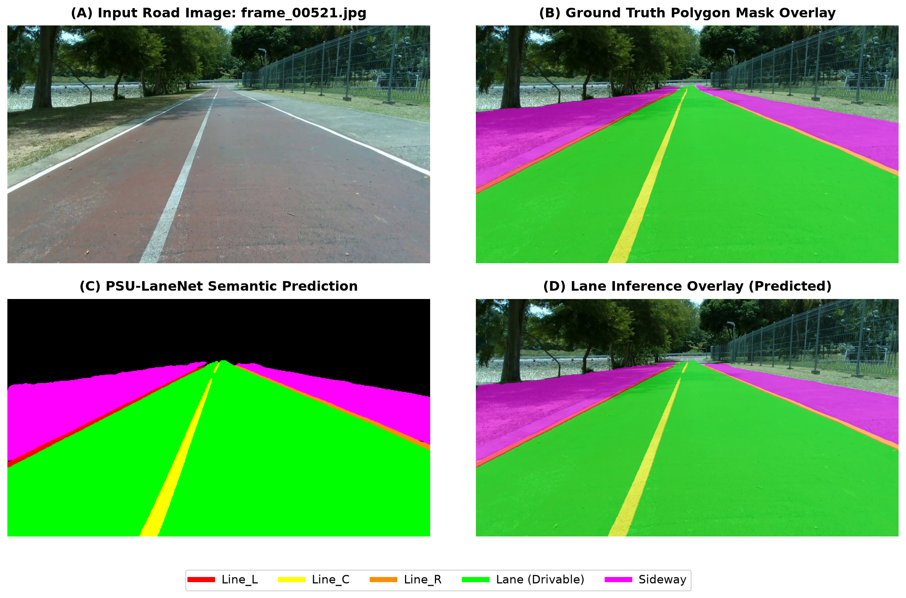
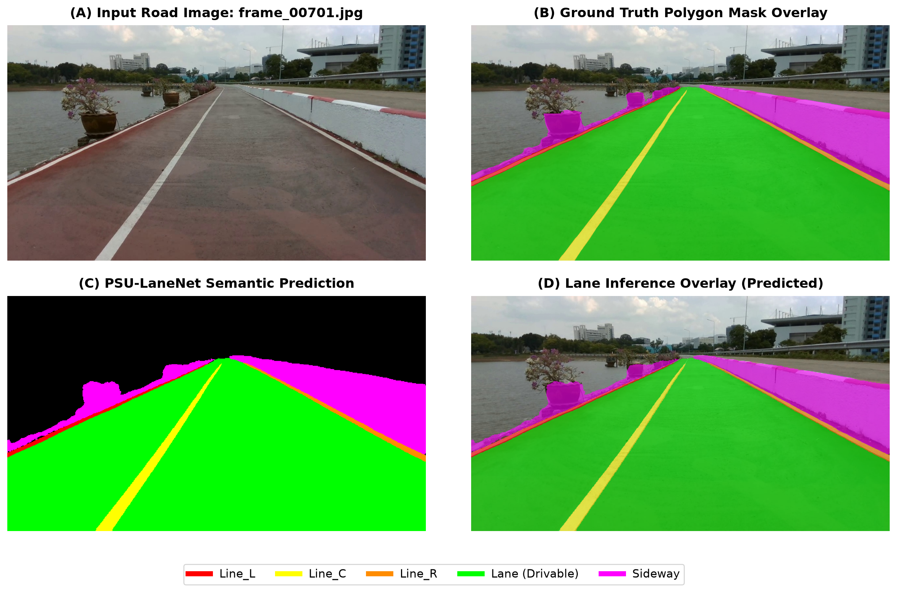
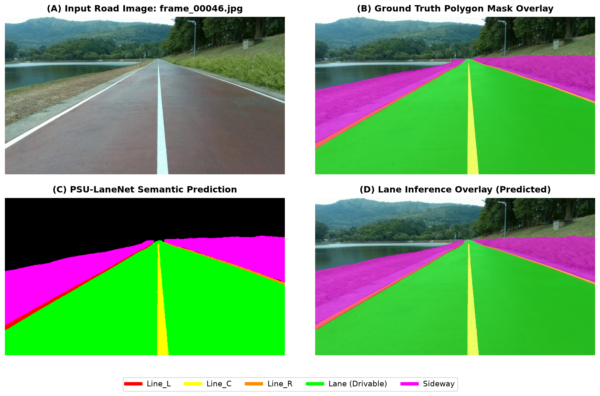
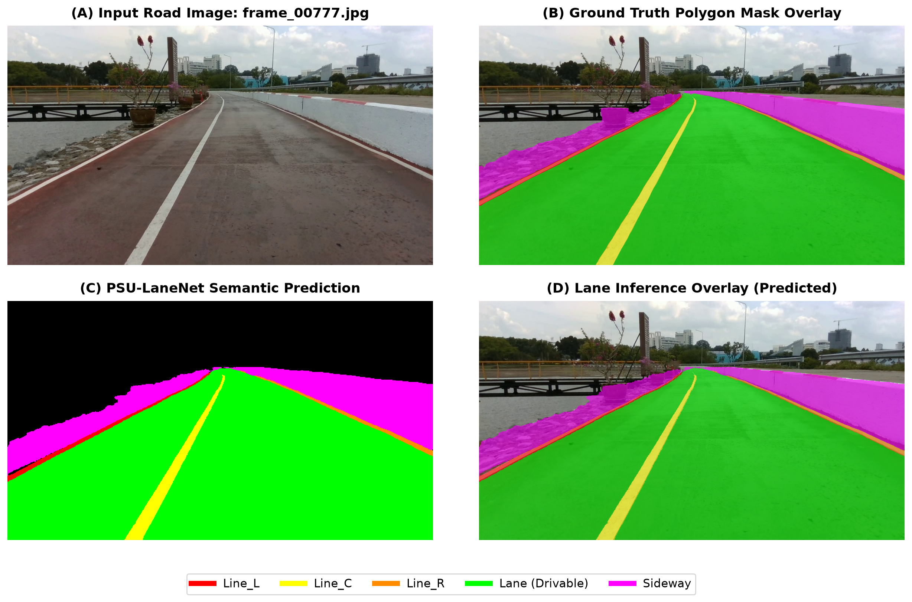

# PSU-LaneNet: Custom Lane Segmentation Neural Network from Scratch
**Assignment-10: Neural Network Design, Implementation, and Evaluation for Lane Segmentation**

> **ผู้จัดทำ (Student Information):**  
> 👤 **ชื่อ-นามสกุล:** นายภัทรพงศ์ เขาไข่แก้ว  
> 🆔 **รหัสนักศึกษา:** 6710110312  

[](https://www.python.org/)
[](https://pytorch.org/)
[]()
[]()
[]()
[]()

---

## 📌 บทนำและวัตถุประสงค์ (Overview)

โครงงานนี้เป็นส่วนหนึ่งของวิชา **Assignment-10: Lane Segmentation Neural Network from Scratch** โดยมีเป้าหมายหลักคือ:
1. **ออกแบบสถาปัตยกรรม Deep Neural Network ขึ้นเองใหม่ทั้งหมด (Custom Architecture)** โดยไม่ใช้ Pre-trained Backbone (เช่น ResNet, VGG, MobileNet) จากภายนอก
2. **ฝึกสอนทุก Layer จากศูนย์ (Trained from Scratch 100%)** ด้วยการสุ่มค่าน้ำหนักเริ่มต้น (Kaiming Normal Initialization)
3. **ออกแบบให้มี Memory Footprint ต่ำเป็นพิเศษ** สามารถประมวลผล Inference แบบ Real-time บนคอมพิวเตอร์ระดับ Local Machine (Laptop/PC ทั่วไป) ทั้งบน GPU และ CPU ได้อย่างมีประสิทธิภาพ
4. **ทำ Semantic Segmentation 6 Classes** บนชุดข้อมูล PSU-reservoir dataset (เฉพาะข้อมูล Polygon Mask):
   - `0: Background` (พื้นหลัง / สภาพแวดล้อมทั่วไป)
   - `1: Line_L` (เส้นแบ่งเลนขอบซ้าย - สีแดง)
   - `2: Line_C` (เส้นประ/เส้นทึบแบ่งเลนกึ่งกลาง - สีเหลือง)
   - `3: Line_R` (เส้นแบ่งเลนขอบขวา - สีส้ม)
   - `4: Lane` (พื้นผิวถนนเลนขับขี่ Drivable Lane - สีเขียว)
   - `5: Sideway` (ขอบทางเท้า / ทางเดินข้างทาง - สีม่วงมาเจนตา)

---

## 🏗️ โครงสร้างสถาปัตยกรรมโมเดล (Neural Network Architecture & Rationale)

โมเดลถูกตั้งชื่อว่า **PSU-LaneNet** ออกแบบตามโครงสร้าง **Encoder-Decoder U-Net Style ร่วมกับ Strip Context Module** ที่ปรับแต่งให้สอดคล้องกับลักษณะทางกายภาพของเส้นทางและเลนถนนโดยเฉพาะ

```
                        [ Input Image: 3 x 384 x 640 ]
                                      │
                                      ▼
                        ┌───────────────────────────┐
                        │   ConvStem (Stride=2)     │ ──┐ (Skip 1: 32ch, 192x320)
                        │     [ 32 x 192 x 320 ]    │   │
                        └─────────────┬─────────────┘   │
                                      ▼                 │
                        ┌───────────────────────────┐   │
                        │ Encoder Stage 1 (DS-Conv) │ ──┼──┐ (Skip 2: 48ch, 96x160)
                        │     [ 48 x 96 x 160 ]     │   │  │
                        └─────────────┬─────────────┘   │  │
                                      ▼                 │  │
                        ┌───────────────────────────┐   │  │
                        │ Encoder Stage 2 (DS-Conv) │ ──┼──┼──┐ (Skip 3: 96ch, 48x80)
                        │     [ 96 x 48 x 80 ]      │   │  │  │
                        └─────────────┬─────────────┘   │  │  │
                                      ▼                 │  │  │
                        ┌───────────────────────────┐   │  │  │
                        │ Encoder Stage 3 (DS-Conv) │   │  │  │
                        │     [ 160 x 24 x 40 ]     │   │  │  │
                        └─────────────┬─────────────┘   │  │  │
                                      ▼                 │  │  │
                        ┌───────────────────────────┐   │  │  │
                        │ Strip Context Bottleneck  │   │  │  │
                        │   (1x7, 7x1 & Dilations)  │   │  │  │
                        │     [ 160 x 24 x 40 ]     │   │  │  │
                        └─────────────┬─────────────┘   │  │  │
                                      ▼                 │  │  │
                        ┌───────────────────────────┐   │  │  │
                        │ Decoder Stage 3 + Skip 3  │ ◄─┘  │  │
                        │     [ 96 x 48 x 80 ]      │      │  │
                        └─────────────┬─────────────┘      │  │
                                      ▼                    │  │
                        ┌───────────────────────────┐      │  │
                        │ Decoder Stage 2 + Skip 2  │ ◄────┘  │
                        │     [ 48 x 96 x 160 ]     │         │
                        └─────────────┬─────────────┘         │
                                      ▼                       │
                        ┌───────────────────────────┐         │
                        │ Decoder Stage 1 + Skip 1  │ ◄───────┘
                        │     [ 32 x 192 x 320 ]    │
                        └─────────────┬─────────────┘
                                      ▼
                        ┌───────────────────────────┐
                        │   Final Head & Upsample   │
                        │     [ 6 x 384 x 640 ]     │
                        └───────────────────────────┘
```

### เหตุผลและแนวคิดในการออกแบบแต่ละส่วน (Design Rationale):

1. **Early Memory Reduction (ConvStem):**
   * ใช้ 2 Sequential $3 \times 3$ Convolutions ที่มี Stride 2 ตั้งแต่ชั้นแรก เพื่อลดมิติภาพลงครึ่งหนึ่ง ($384\times 640 \to 192\times 320$) ทันที ช่วยลด Feature Map Memory ในเลเยอร์ถัดๆ ไปได้ถึง **75%** ทำให้โมเดลประหยัด VRAM สูงมากในขณะเทรนและทดสอบ
2. **Depthwise-Separable Convolutions & Residual Connections:**
   * ในส่วน Encoder ใช้ Depthwise-Separable Convolution (Depthwise $3\times 3$ + Pointwise $1\times 1$) แทน Standard Convolution ช่วยลดจำนวน Parameter และการคำนวณ FLOPs ลงได้กว่า **80%**
   * มี Residual Skip Connection ภายในแต่ละบล็อก เพื่อป้องกันปัญหา Vanishing Gradient ทำให้สามารถเทรน Network จาก Scratch ได้อย่างเสถียรและลู่เข้าไว
3. **Strip & Atrous Context Bottleneck (SCB):**
   * ปัญหาสำคัญของ Lane Detection คือ เส้นเลนเป็นวัตถุที่มีลักษณะแคบ ยาว และมีมุมมองทัศนมิติ (Perspective) ลู่เข้าสู่ขอบฟ้า
   * เราจึงออกแบบบล็อก Bottleneck ที่มี **Strip Convolutions ($1 \times 7$ และ $7 \times 1$)** ควบคู่กับ **Dilated Convolutions (Dilation Rate = 2, 4)** เพื่อขยาย Receptive Field ให้ครอบคลุมแนวทิศทางของเส้นถนนทั้งแนวนอนและแนวตั้ง โดยไม่ต้องเพิ่มพารามิเตอร์จำนวนมาก
4. **Lightweight Decoder with High-Resolution Skip Connections:**
   * สถาปัตยกรรมสไตล์ U-Net ดึงฟีเจอร์ระดับต่ำ (Low-level features) จาก Stem และ Encoder แต่ละระดับมาผสานเข้ากับฟีเจอร์ระดับสูงใน Decoder ผ่านการ Upsampling แบบ Bilinear
   * ช่วยกู้คืนรายละเอียดขอบเส้นเลน (Edge Sharpness) และขอบทางเท้า ทำให้ Segment ได้อย่างคมชัด ไม่เบลอหรือขาดตอน

---

## 📉 กราฟการลู่เข้าของ Loss และ Metrics (Training Convergence)

โมเดลถูกฝึกสอนเป็นจำนวน 20 Epochs ด้วย **Compound Loss (Focal Loss $\gamma=2.0$ + Multiclass Dice Loss)** ร่วมกับ **AdamW Optimizer** และ **Cosine Annealing Learning Rate Scheduler** ($1\times 10^{-3} \to 1.6\times 10^{-5}$)

### 1. กราฟ Loss Convergence
แสดงผลรวมของ Focal Loss และ Dice Loss ทั้งบน Training Set และ Validation Set:



> **การวิเคราะห์การลู่เข้า:**
> * ใน Epoch 1: Loss เริ่มต้นที่ `0.5235` (Train) และ `0.1286` (Val)
> * Loss ลดลงอย่างรวดเร็วในช่วง 5 Epochs แรก และค่อยๆ ลู่เข้าอย่างต่อเนื่องจนกระทั่งนิ่งที่ `0.0340` (Train) และ `0.0414` (Val) ใน Epoch 18–20
> * เส้นกราฟของ Training และ Validation วิ่งเกาะกลุ่มขนานกัน ไม่มี Gap ที่ถ่างกว้าง ยืนยันว่าโมเดลไม่มีปัญหา Overfitting

### 2. กราฟ Validation Metrics Convergence
แสดงความแม่นยำ Mean IoU (%) และ Pixel Accuracy (%):



---

## 📊 ผลการวัดประสิทธิภาพของโมเดล (Evaluation Results)

วัดผลบนชุดข้อมูลทดสอบ (Validation Set: 200 ภาพ ที่แยกออกจากขั้นตอน Training อย่างเด็ดขาด) ได้ค่าทางสถิติระดับภาพรวมและระดับรายคลาส ดังนี้:

### 1. ผลประเมินระดับภาพรวม (Overall Performance)

| ตัวชี้วัด (Metric) | ค่าที่ได้ (Score) | คำอธิบาย |
| :--- | :---: | :--- |
| **Mean IoU (mIoU)** | **`93.69%`** | ดัชนีวัดความแม่นยำของขอบเขตพื้นที่เฉลี่ยทุกคลาส |
| **Mean Dice (mF1)** | **`96.70%`** | ค่าเฉลี่ยฮาร์โมนิก F1-Score รวมทุกคลาส |
| **Pixel Accuracy** | **`98.94%`** | อัตราส่วนพิกเซลที่ทำนายได้ถูกต้องต่อพิกเซลทั้งหมด |
| **Test Loss** | **`0.0416`** | Compound Loss รวมบน Validation Set |

### 2. ผลประเมินจำแนกรายคลาส (Per-Class Detailed Metrics)

| คลาส (Class) | ความหมาย | IoU (%) | Dice / F1 (%) | Precision (%) | Recall (%) |
| :--- | :--- | :---: | :---: | :---: | :---: |
| **Background** | พื้นหลังสภาพแวดล้อม | 97.68% | 98.82% | 99.01% | 98.64% |
| **Line_L** | เส้นแบ่งเลนขอบซ้าย | 89.29% | 94.34% | 94.26% | 94.43% |
| **Line_C** | เส้นแบ่งเลนกึ่งกลาง | 94.19% | 97.01% | 97.28% | 96.74% |
| **Line_R** | เส้นแบ่งเลนขอบขวา | 88.68% | 94.00% | 93.30% | 94.71% |
| **Lane** | ผิวจราจรเลนขับขี่ | **99.55%** | **99.78%** | 99.79% | 99.77% |
| **Sideway** | ทางเท้า / ขอบทางข้าง | 92.77% | 96.25% | 95.64% | 96.87% |

> **สรุปประสิทธิภาพ:** ทุกคลาสที่เป็นเส้นเลน (`Line_L`, `Line_C`, `Line_R`) ได้ค่า F1-Score สูงกว่า **94%** และผิวจราจรเลนขับขี่ (`Lane`) ทำคะแนนได้สูงถึง **99.55% IoU**

---

## 🖼️ ตัวอย่างผลการทดสอบการอนุมาน (Inference Visual Snapshots)

แสดงภาพเปรียบเทียบ 4 มิติ ประกอบด้วย:
- **(A) Input Road Image:** ภาพต้นฉบับความละเอียดสูงจากกล้องหน้ารถ
- **(B) Ground Truth Mask Overlay:** มาร์กเกอร์ Polygon ดั้งเดิมจาก Dataset
- **(C) PSU-LaneNet Semantic Prediction:** แผนที่ Mask สี 6 Classes ที่โมเดลทำนาย
- **(D) Lane Inference Overlay:** ภาพแสดงผลการฉาย Mask โปร่งแสงทับบนถนนจริง

### ตัวอย่างที่ 1: เฟรม `frame_00930`


### ตัวอย่างที่ 2: เฟรม `frame_00521`


### ตัวอย่างที่ 3: เฟรม `frame_00701`


### ตัวอย่างที่ 4: เฟรม `frame_00046`


### ตัวอย่างที่ 5: เฟรม `frame_00777`


---

## ⚡ การวัด Memory Footprint และความเร็ว (Hardware Benchmarking)

ทดสอบการประมวลผล Inference ด้วยภาพ Input ขนาดจริง ($1 \times 3 \times 384 \times 640$) ผ่านสคริปต์ `utils/benchmark.py`:

| รายการทรัพยากร (Metric) | GPU (NVIDIA RTX 5060 Laptop) | CPU (Host Machine) |
| :--- | :---: | :---: |
| **จำนวนพารามิเตอร์โมเดล (Parameters)** | **464,238 (~0.46M)** | **464,238 (~0.46M)** |
| **ขนาดไฟล์น้ำหนักโมเดล (.pth file)** | **1.87 MB** | **1.87 MB** |
| **ภาระการคำนวณ (FLOPs / MACs)** | **9.21 GFLOPs** (4.60 GMACs) | **9.21 GFLOPs** (4.60 GMACs) |
| **Peak GPU VRAM Usage** | **150.31 MB** | ไม่ได้ใช้งาน GPU |
| **Peak System RAM Usage** | ~916 MB | ~1,069 MB |
| **ความเร็วเฉลี่ยต่อเฟรม (Latency)** | **`5.93 ms / frame`** | **`95.38 ms / frame`** |
| **อัตราการประมวลผล (Throughput)** | **`168.7 FPS` (Real-Time)** | **`10.5 FPS`** |

> **ข้อสรุปด้านทรัพยากร:** โมเดลใช้ VRAM เพียง **~150 MB** และขนาดไฟล์เพียง **1.87 MB** สามารถนำไปติดตั้งใช้งานบน Edge Device, Embedded Systems หรือโน้ตบุ๊กราคาประหยัดที่ไม่มี GPU แรงสูงได้อย่างไร้ปัญหา

---

## 📂 โครงสร้างไดเรกทอรี (Directory Structure)

```
Assignment-10 Neural network from scratch/
├── configs/
│   └── default_config.yaml         # ไฟล์ตั้งค่าไฮเปอร์พารามิเตอร์และพาธข้อมูล
├── data/
│   ├── dataset.py                  # PyTorch Dataset รองรับ Polygon Rasterization & Augmentation
│   ├── split_data.py               # สคริปต์สุ่มแยก Train/Validation Split (80:20)
│   └── splits/
│       ├── train_images.txt        # รายการภาพ Train (800 รูป)
│       └── val_images.txt          # รายการภาพ Validation (200 รูป)
├── models/
│   ├── blocks.py                   # ConvStem, DepthwiseSeparableConv, StripContextBottleneck
│   └── custom_lane_net.py          # สถาปัตยกรรมโมเดล PSU-LaneNet
├── utils/
│   ├── losses.py                   # Compound Loss (Focal + Dice Loss)
│   ├── metrics.py                  # IoU, Dice, Precision, Recall, Pixel Accuracy Tracker
│   └── benchmark.py                # เครื่องมือวัด Latency, FPS, FLOPs และ Memory Footprint
├── checkpoints/
│   ├── best_model.pth              # น้ำหนักโมเดลที่ดีที่สุด (Val mIoU 93.69%)
│   ├── latest_model.pth            # น้ำหนักโมเดล Epoch สุดท้าย
│   ├── training_history.json       # บันทึกประวัติ Loss/Metrics ตลอด 20 Epochs
│   ├── evaluation_results.json     # บันทึกผลการประเมินแยกรายคลาส
│   ├── loss_convergence.png        # กราฟแสดงการลู่เข้าของ Loss
│   └── metrics_convergence.png     # กราฟแสดงการลู่เข้าของ Metrics
├── snapshots/                      # ภาพ Snapshots ผลการ Inference 5 ตัวอย่าง
├── train.py                        # สคริปต์หลักสำหรับฝึกสอนโมเดลจาก Scratch
├── evaluate.py                     # สคริปต์ประเมินผลเชิงตัวเลขบน Validation Set
├── predict.py                      # สคริปต์ทดสอบและสร้างภาพ Overlay ผลการทำนาย
├── requirements.txt                # รายการไลบรารีที่จำเป็น
└── README.md                       # เอกสารสรุปรายงานโครงงานฉบับสมบูรณ์
```

---

## 🚀 วิธีการติดตั้งและรันโปรเจกต์ (Installation & Usage)

### 1. การเตรียม Environment
```bash
# สร้างและเปิดใช้งาน Virtual Environment (แนะนำ)
python -m venv venv
.\venv\Scripts\activate   # สำหรับ Windows

# ติดตั้งไลบรารีที่จำเป็น
pip install -r requirements.txt
```

### 2. การเทรนโมเดลใหม่จากศูนย์ (Train from Scratch)
```bash
python train.py --config configs/default_config.yaml --epochs 20 --batch-size 8
```

### 3. การประเมินผลประสิทธิภาพ (Evaluate Model)
```bash
python evaluate.py --checkpoint checkpoints/best_model.pth --config configs/default_config.yaml
```

### 4. การทดสอบการทำนายและบันทึกภาพผลลัพธ์ (Inference Snapshots)
```bash
python predict.py --checkpoint checkpoints/best_model.pth --samples 5 --output snapshots
```

### 5. การวัด Memory Footprint และ Benchmark ความเร็ว
```bash
python utils/benchmark.py
```

---

## 📚 งานวิจัยและเอกสารอ้างอิง (Related Works & References)

1. **Ultra-Fast-Lane-Detection-Inference-Pytorch:**
   * Repository: [https://github.com/ibaiGorordo/Ultrafast-Lane-Detection-Inference-Pytorch-](https://github.com/ibaiGorordo/Ultrafast-Lane-Detection-Inference-Pytorch-)
   * แนวคิด: การตรวจจับเส้นเลนด้วยความเร็วสูงโดยเน้นการใช้ทรัพยากรคำนวณอย่างคุ้มค่า
2. **YOLOTL (Lane Detection & Segmentation):**
   * Repository: [https://github.com/Highsky7/YOLOTL](https://github.com/Highsky7/YOLOTL)
   * แนวคิด: สถาปัตยกรรมแบบ One-Stage สำหรับงานตรวจจับวัตถุและแบ่งส่วนเลนถนนพร้อมกัน
3. **Strip Pooling (SPNet):**
   * Hou, Q., Zhang, L., Cheng, M. M., & Feng, J. (2020). *Strip Pooling: Rethinking Spatial Pooling for Scene Parsing*. CVPR 2020.
   * เป็นแรงบันดาลใจในการนำแถบ Convolution แนวนอน/แนวตั้ง ($1\times K, K\times 1$) มาช่วยตรวจจับโครงสร้างแนวยาวของเส้นทาง
4. **Focal Loss & Dice Loss Combination:**
   * Lin, T. Y., et al. (2017). *Focal Loss for Dense Object Detection*. ICCV 2017.
   * Sudre, C. H., et al. (2017). *Generalised Dice overlap as a deep learning loss function for highly unbalanced segmentations*. NIPS DLMIA.
